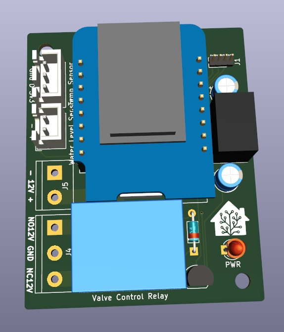
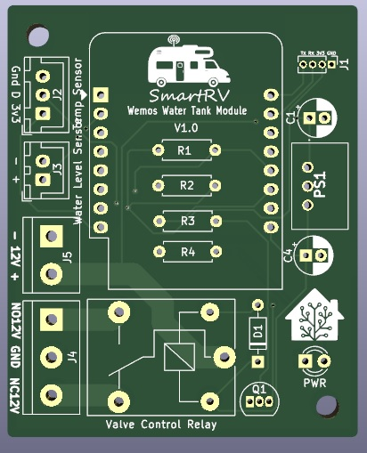

# SmartRV-Water-Tank-Module
**A Wemos based water tank module for a Camper/RV**

**V1.0**
This is the first revision of the Water Tank Module, It is designed to be able to operate either standalone via a WiFi AP or connected to an existing WiFi network and local access is provided via the IP address. It is also able to interface directly with home automation software on local network such as Home Assistant. 

The module has been kept as compact as possible and allows for a direct connection to 12v or 24v vehicle systems. 

**Features**
- Removeable WemosD1 chip (ESP8266)
- Onboard power regulation
- Variable voltage input 8v-36v
- Compact form factor
- DS18b20 temperature sensor
- Resistive water level sensor
- 10A relay for water valve control
- LED Indicator for Relay-ON

<table>
  <tr>
    <td>3D Model</td>
     <td>PCB Layout</td>
  </tr>
  <tr>
    <td></td>
    <td></td>
  </tr>
 </table>

**WARNING**
This board does not have any fuse protection as such this must be provided externally.

